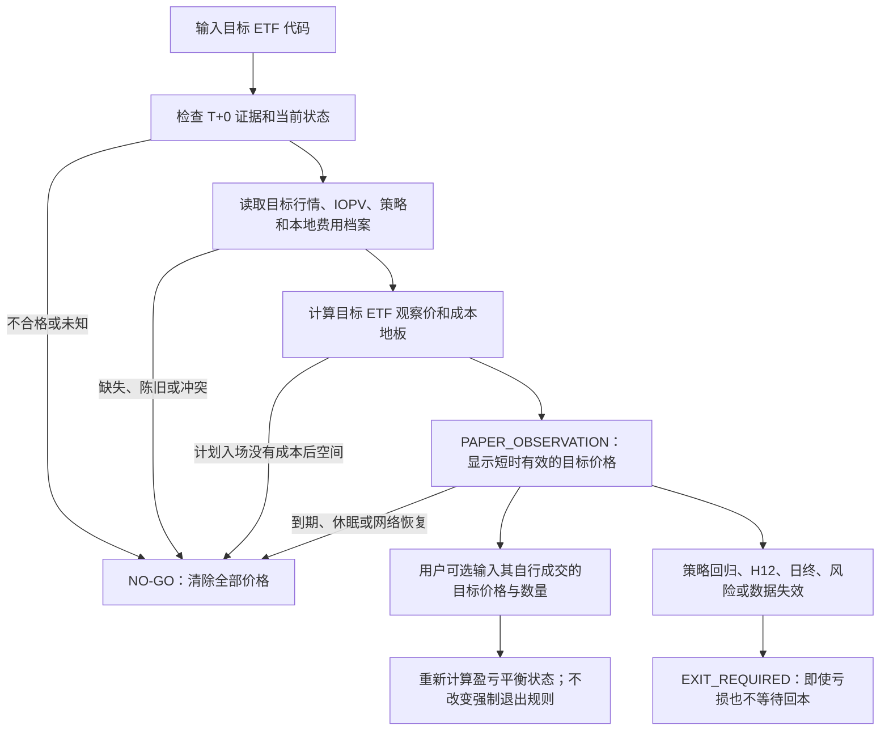

# 目标 ETF 单代码桌面观察应用设计

- 状态：Proposed v0.2
- 任务：Issue #24
- 日期：2026-07-26
- 范围：产品、界面、应用服务与安全边界设计；不包含代码实现

## 1. 设计结论

推荐采用“极简主屏 + 永久在线门禁 + 可展开审计抽屉”的本机桌面应用。用户日常只输入一个六位目标 ETF 代码，只观察和自行操作这个目标 ETF。IOPV、目标自身的滚动行情以及经批准的指数、主题或市场参考都由后台处理，不要求用户输入、盯盘或交易代理标的。

应用只提供研究与人工决策支持：没有买入/卖出按钮，不连接券商，不保存账户凭据，也不自动生成或提交订单。

产品必须区分两个模式：

- `PAPER_OBSERVATION`：可以显示明确标记的纸面观察价，用于数据链路、计算和人工记录；不构成实盘准入或推荐。
- `CONTROLLED_LIVE_VALIDATION`：只有 G0–G7 全部通过后才可能启用。当前项目禁用该模式。

两种模式使用不同门禁：

- 纸面观察硬门禁：G1、已冻结注册策略、当日正常重合连续竞价时段、当前快照与策略输入有效、保守费用档案可计算、计划入场具有成本覆盖空间。
- 实盘准入硬门禁：G0–G7 全部通过，并且纸面观察硬门禁同时通过。

G0、项目级 G2–G7 未通过时，可以显示带 `PAPER_OBSERVATION` 水印的研究价，但不能显示“实盘推荐”“可交易”或 `CONTROLLED_LIVE_VALIDATION`。纸面硬门禁任一失败时，价格为空。

| 阶段门 | 纸面观察 | 受控实盘验证 |
| --- | --- | --- |
| G0 费用账单校准 | 可使用保守临时档案，但固定显示 `PROVISIONAL` | 阻断 |
| G1 标的资格 | 阻断 | 阻断 |
| G2 项目级数据验收 | 未通过时只允许合格当前快照的研究显示 | 阻断 |
| G3 可执行性数据验收 | 未通过时不声称可成交 | 阻断 |
| G4–G7 策略、样本外、稳健与模拟 | 未通过时保持纸面水印 | 阻断 |

纸面模式仍要求当前快照自身通过日期、连续竞价时段、时效、字段、策略输入和成本覆盖检查；“项目级 G2/G3 未通过”不是允许陈旧或缺失行情的例外。

因此，界面中用户口语所称“推荐价格”在当前阶段统一命名为：

- **观察买入价上限**：只在目标 ETF 卖一价不高于该值时形成观察条件。
- **观察卖出价下限**：只在已持有且目标 ETF 买一价不低于该值时形成回归观察条件。

## 2. 三种候选方案

### 方案 A：极简“一码出价”

单窗口只包含代码输入、两个目标价格、有效期和一句状态说明。它最适合 30 秒内完成日常查看，也最能避免用户误以为需要交易代理标的。代价是价格形成过程不够透明，研究异常较难定位。

### 方案 B：可解释研究工作台

除目标价格外，展示锚点、成本、波动缓冲、数据版本和逐步计算。它最利于学习和审计，但主屏信息较多，容易让不熟悉术语的用户把注意力从目标 ETF 转移到模型细节。

### 方案 C：安全闸门式操作台

资格、交易日、行情时效、锚点、成本和阶段门全部通过后才显示价格。它最难被误用，但当前 G0、G2–G7 未通过时会长期只显示 No-Go，无法承担纸面观察和数据验证界面的作用。

三者最大的分歧不是视觉风格，而是“未获得实盘准入时能否显示研究价”。推荐方案保留 C 的失效关闭规则，同时引入独立的 `PAPER_OBSERVATION` 状态承接 A 的简单体验；B 的计算细节放入可展开审计抽屉，而不是占据主屏。

## 3. 推荐主界面

```text
┌──────────────────────────────────────────────────────────────┐
│ T+0 ETF 人工观察台     纸面观察｜不连接券商｜不会自动下单    │
│ ETF代码 [ 159570 ] [开始观察]               数据 10:35:15 ● │
├──────────────────────────────────────────────────────────────┤
│ 159570  港股通创新药ETF汇添富                状态：等待条件   │
│ T+0资格 ✓   交易时段 ✓   行情时效 ✓   实盘准入 ✕             │
├────────────────────────────┬─────────────────────────────────┤
│ 观察买入价上限              │ 策略卖出观察线                  │
│ ≤ ¥X.XXX                   │ ≥ ¥Y.YYY                       │
│ 比较目标ETF卖一价           │ 比较目标ETF买一价               │
│ 当前尚未触发                │ 盈亏平衡参考另列                │
├────────────────────────────┴─────────────────────────────────┤
│ 按本地档案：¥10,000｜100份整数倍｜往返最低佣金¥10           │
│ 盈亏平衡参考：¥B.BBB｜强制退出不会等待回本                  │
│ 计算于 10:35:15｜有效至 10:35:45｜过期后自动清除             │
├──────────────────────────────────────────────────────────────┤
│ 目标ETF价格图：买一/卖一、观察买入线、观察卖出线、有效区间  │
├──────────────────────────────────────────────────────────────┤
│ [为什么是这个价格] [输入我实际的目标ETF成交价] [导出记录]   │
└──────────────────────────────────────────────────────────────┘
```

主界面不显示代理 ETF 代码或价格。审计抽屉可以说明“系统使用了哪些内部参考、时间戳和版本”，但不会提供代理买卖价、代理仓位或代理操作按钮。

设置页只需配置一次并保存在本机：

- 计划使用金额或每次目标金额。
- 佣金率、每笔最低佣金和部分成交收费口径。
- 默认价差、滑点和安全缓冲。
- 是否已有基础仓位及可卖数量；不读取券商账户。

未完成交割单校准时，费用档案固定显示 `PROVISIONAL`，不得显示实盘准入。

## 4. 用户流程与状态机



状态定义：

- `INPUT_REQUIRED`：等待六位代码。
- `CHECKING`：清除上一次价格并重新计算。
- `NO_GO`：显示阻断原因，价格必须为空。
- `WAIT`：纸面观察策略和数据可用，但当前目标报价尚未触发。
- `ENTRY_OBSERVATION`：目标卖一价达到观察买入条件；仍不是下单指令。
- `POSITION_OBSERVATION`：用户手工录入目标 ETF 的实际成交价与数量后，监控目标买一价。
- `EXIT_REQUIRED`：目标买一价达到冻结策略退出线，或最大持有、日终、风险及预设数据失效退出被触发；这是持仓态唯一的退出状态，成本是否收回只作为状态显示，不得延迟退出。
- `EXPIRED`：价格立即清除并重新检查。

## 5. 价格计算契约

输入 ETF 代码并不足以为任意 ETF 产生有效价格。后台还必须存在：

1. 交易所级 T+0 证据和当前上市状态。
2. 为该目标 ETF 注册且版本化的观察策略。
3. 同一时点可用的目标 bid/ask、IOPV 或策略需要的内部参考数据。
4. 本地资金和费用档案。
5. 合法 100 份交易单位、可用现金或用户声明的可卖基础仓位。

没有注册策略时直接 No-Go，不得临时套用固定 EMA 或历史高低点。

每个策略适配器先产生目标 ETF 的因果阈值：

```text
signal_buy_ceiling  = floor_tick(策略入场阈值)
strategy_exit_level = ceil_tick(策略退出阈值)
```

成本地板从计划的目标 ETF 卖一成交价或用户报告的实际成交价 `entry_fill` 出发，按计划数量 `q` 逐 tick 求解。最小合法卖出价格 `p` 必须满足：

```text
q × (p - entry_fill)
- buy_fee(entry_fill, q)
- sell_fee(p, q)
- additional_execution_buffer_cny
>= safety_cash_cny
```

`buy_fee` 和 `sell_fee` 同时接收价格和数量，以支持按成交额计佣金、每侧最低收费及取整规则。由于 `entry_fill` 已是计划 ask 或实际成交价、`p` 是计划用 bid 判断的卖出价，方向性 bid/ask 成本已经进入可执行价格，不再重复添加同一 spread。若要做额外压力，只能命名为 `additional_spread_stress` 或额外滑点/冲击现金缓冲。

逐 tick 找到的 `break_even_reference` 是入场成本门禁和盈亏状态，不覆盖冻结策略的退出规则：

```text
entry_cost_gate = strategy_exit_level >= break_even_reference
sell_observation_level = strategy_exit_level
```

计划入场若不能覆盖成本，返回 `NO_GO`，原因为 `NO_GO_ENTRY_COST`。一旦已有仓位，策略回归退出、H12 最大持有、日终、止损、回撤或预设数据失效退出均可触发 `EXIT_REQUIRED`；报价有效时按当前可执行目标 bid 记录纸面退出，即使低于盈亏平衡参考，也不得为了“等回本”延长持有。若触发原因正是行情陈旧，则价格保持为空，只显示 `stale_data` 风险退出状态并等待用户从券商端独立判断；旧 bid 只保留为审计证据，不能作为当前退出价。

计划盈亏平衡价只能按计划入场价估算。用户若在项目外自行成交，可通过独立的手工成交记录绑定原 `decision_id`，输入目标 ETF 实际成交时间、合法 tick 价格、100 份整数数量、实际或临时买入费用、拆单/部分成交次数和验证状态。系统创建新决策快照并重算盈亏状态，但绝不修改原始快照。缺少账单证据时标记 `user_reported_unverified`，不得并入策略绩效。

每个注册策略还必须保存目标与锚点、公式和 bar 时序、训练窗口、完整参数选择日志、冻结时间、前向起点、代码与数据哈希、样本外状态和允许模式。新 ETF、锚点或参数必须创建新版本和新前向起点，不能在桌面输入代码后即时用既有 30 日样本挑选最优模型。

## 6. 159570 的目标标的展示示例

159570 是当前唯一值得继续前向观察的研究候选，但尚未获得实盘策略准入。其冻结策略可以在后台使用 513780 计算目标价格，用户不需要查看或操作 513780。

以历史冻结状态举例：若后台同步参考条件对应 159570 的入场阈值 1.413、回归阈值 1.417，主界面只显示：

```text
目标 ETF：159570
观察买入价上限：1.413
策略卖出观察线：1.417
盈亏平衡参考：按计划数量和费用档案另算
模式：纸面观察
状态：尚未获得实盘策略准入
```

这些数字仅用于说明界面和冻结历史计算。它们不是脱离实时行情的次日固定区间，应用不得在数据失效后继续显示。

100 份时双边最低 10 元佣金相当于 100 ticks，无法由该示例的 4-tick 价差覆盖，因此纸面入场门禁应为 No-Go。按约 1 万元计算时，佣金约为 1.43 ticks，但仍缺真实滑点、排队和部分成交验证；应用必须显示费用档案为临时口径并保持实盘准入关闭。

## 7. 应用服务接口

桌面界面只调用一个目标标的服务；研究模块内部保留多个锚点适配器。

```python
from dataclasses import dataclass
from datetime import datetime
from decimal import Decimal
from typing import Literal, Protocol


@dataclass(frozen=True)
class TargetObservationRequest:
    etf_code: str
    profile_id: str = "default-manual-profile"


@dataclass(frozen=True)
class UserReportedFillRequest:
    origin_decision_id: str
    fill_time: datetime
    entry_price: Decimal
    quantity: int
    actual_buy_fee: Decimal | None
    fill_count: int
    verification: Literal["user_reported_unverified", "statement_verified"]


@dataclass(frozen=True)
class PriceLevel:
    price: Decimal
    relation: Literal["at_or_below", "at_or_above"]
    valid_until: datetime


@dataclass(frozen=True)
class GateResult:
    code: str
    status: Literal["pass", "fail", "unknown"]
    public_reason: str


@dataclass(frozen=True)
class TargetObservationDecision:
    decision_id: str
    etf_code: str
    etf_name: str | None
    mode: Literal["paper_observation", "controlled_live_validation"]
    status: Literal[
        "no_go", "wait", "entry_observation",
        "position_observation", "exit_required", "expired"
    ]
    target_bid: Decimal | None
    target_ask: Decimal | None
    buy_observation_ceiling: PriceLevel | None
    strategy_exit_level: PriceLevel | None
    break_even_reference: Decimal | None
    exit_reason: Literal[
        "strategy_reversion", "maximum_holding", "end_of_day",
        "risk_stop", "stale_data"
    ] | None
    cost_recovered: bool | None
    estimated_quantity: int | None
    round_trip_cost_cny: Decimal | None
    gates: tuple[GateResult, ...]
    reasons: tuple[str, ...]
    policy_version: str | None
    data_snapshot_id: str | None
    generated_at: datetime


class TargetObservationService(Protocol):
    def evaluate(
        self, request: TargetObservationRequest
    ) -> TargetObservationDecision: ...

    def explain(self, decision_id: str) -> "DecisionTrace": ...

    def record_user_fill(
        self, request: UserReportedFillRequest
    ) -> TargetObservationDecision: ...

    def export(self, decision_id: str) -> "Path": ...
```

接口不提供 `place_order`、`cancel_order`、代理仓位或券商凭据方法。`NO_GO`、`EXPIRED` 与持仓中的 `EXIT_REQUIRED(stale_data)` 都不能携带任何可被当作当前价格的字段：

```python
prices_must_be_empty = decision.status in {"no_go", "expired"} or (
    decision.status == "exit_required" and decision.exit_reason == "stale_data"
)
if prices_must_be_empty:
    assert decision.target_bid is None
    assert decision.target_ask is None
    assert decision.buy_observation_ceiling is None
    assert decision.strategy_exit_level is None
    assert decision.break_even_reference is None
```

无仓位遇到陈旧行情进入 `NO_GO`；已有用户报告仓位时进入 `EXIT_REQUIRED(stale_data)`，仅提示风险退出状态并保留不可见于价格卡的历史审计快照。两者都不会显示旧价格。

生产 `evaluate` 不接受 `as_of`。它使用服务内部注入、不可由桌面 UI 修改的可信时钟计算数据年龄和 `valid_until`。历史回放与单元测试使用独立的 replay/test 接口，不能通过生产请求回拨时间令陈旧报价通过。

## 8. 内部架构

推荐首版技术路线为 Python 3.11 + PySide6：它可以直接复用现有 Python 数据、费用、台账和研究模块，所有数据继续留在本机。打包阶段再评估 PyInstaller 或 `pyside6-deploy`。

```text
PySide6 Desktop UI
        │
TargetObservationService
        ├── UniverseEligibilityService
        ├── QuoteAndFreshnessService
        ├── ObservationPolicyRegistry
        │      ├── IOPV adapter
        │      ├── target VWAP/EMA adapter
        │      └── internal-reference residual adapter
        ├── FeeAndBreakEvenEngine
        ├── GateEvaluator
        └── ImmutableDecisionJournal
```

复杂度隐藏在服务内部，但审计抽屉可以通过 `decision_id` 查看数据时间、策略版本、费用档案、配置哈希和拒绝原因。内部参考标的可出现在审计证据中，但绝不成为用户交易动作。

## 9. 强制失效关闭

以下任一情况均失效关闭并清除价格；无仓位通常进入 No-Go，已有用户报告仓位时按预设退出状态处理：

- 目标 ETF 不在已确认 T+0 台账、停牌、退市风险或证据待复核。
- 非正常重合交易日、申购赎回关闭，或依赖的香港市场/内部参考未正常交易。
- 不在 09:30–11:30、13:00–14:57 连续竞价窗口；09:15–09:25 开盘集合竞价、午休、14:57–15:00 收盘集合竞价及盘后均清除价格。
- 目标 bid/ask、IOPV 或必要内部输入缺失、日期非当日、交叉、陈旧或长时间不更新；无仓位进入 No-Go，有用户报告仓位进入无价格的 `EXIT_REQUIRED(stale_data)`。
- 五分钟信号尚未完成，或下一可用 quote 时条件已消失。
- 买卖价差异常、深度不足、模型输入冲突或数据源切换未重新验证。
- 计划入场到策略退出线不能覆盖双边佣金及额外滑点、冲击和安全缓冲；已有仓位的强制退出不受回本价限制。
- 应用从休眠恢复、网络重连、策略版本或费用档案变化。
- 当前模式请求 `CONTROLLED_LIVE_VALIDATION`，但 G0–G7 任一未通过。

公共行情不证明券商端真实可成交。应用不得显示胜率保证、预计必赚、套利或确定性买卖措辞。

## 10. 实施分期

### M0：设计确认

- 用户确认主界面、纸面观察模式和可选手工成交价流程。
- 冻结 `TargetObservationDecision` 接口和状态机。

### M1：可运行只读原型

- PySide6 单窗口、代码输入、资格查询、No-Go 展示。
- 使用固定测试夹具验证状态切换，不接实时行情。
- 测试可信时钟、午休、集合竞价、盘后和恢复后清价。

### M2：本地数据集成

- 接入目标行情、IOPV、费用档案和已有策略注册表。
- 增加短时价格、盈亏平衡参考、强制退出状态、失效清除、审计日志和目标 ETF 图表。

### M3：纸面前向观察

- 至少 20 个交易日记录每次目标价格、触发、失效和人工观察结果。
- 对照券商可见行情，不提交订单。

### M4：受控验证候选

- 只有 G0–G7 全部通过后，另行评审是否开放受控人工实盘验证状态。

## 11. 设计验收标准

- 日常主流程只要求输入一个目标 ETF 代码。
- 主屏只显示该目标 ETF 的 bid/ask 和观察价格，不显示代理操作。
- 任意目标 ETF 都必须先经过资格、策略、数据、成本和阶段门检查。
- No-Go、过期和 stale-data 退出状态不携带或保留 target bid/ask、观察线或盈亏平衡价格。
- 每个价格带生成时间、失效时间、策略版本、数据快照和费用档案。
- 计划入场必须通过双边费用和额外执行缓冲门禁；实际成交后可用绑定原决策的手工记录重算盈亏状态。
- H12、日终和风险退出独立于回本价，`EXIT_REQUIRED` 不得等待成本收回。
- 生产 UI 不能覆盖可信时钟；午休、集合竞价及盘后不保留价格。
- 代理只可作为后台可审计输入，永不成为第二个订单腿。
- 主界面始终显示纸面观察或受控验证模式，不使用保证盈利措辞。
- 没有券商连接、自动下单、账户凭据或订单快捷方式。
